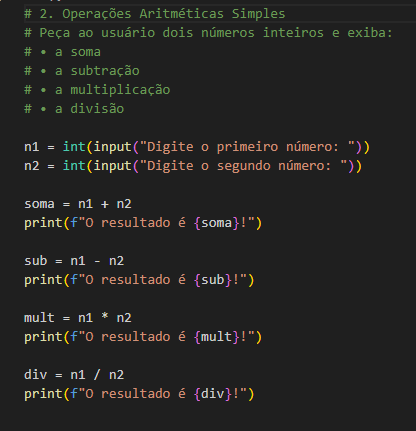

# logica-de-programacao

## Aulas práticas com foco em Python

### Conceitos básicos
Na disciplina de lógica no curso técnico de Análise e Desenvolvimento de Sistemas, estou aprendendo alguns conceitos básicos sobre Python.

Criei alguns progamas e consegui aprender na prátiva sobre:

 `Variáveis:` Para declarar uma variável, atribuimos um nome a uma valor, usando o operador de atribuição (=).

 `Condicionais:` Permitem que o programa tome decisões e execute diferentes blocos de código com base em condições específicas, usando If, Else e Elif.

 `Tipos de Dados:`  Existem várias categorias de tipos de dados embutidos, incluindo numéricos (como int, float, complex), sequências (como str, list, tuple) e o tipo booleano (bool). A escolha do tipo de dados adequado é essencial para realizar operações corretamente e manipular informações de forma eficiente. 

 ### Abaixo anexei uma imagem de um dos exercícios básicos que servem como base para entendimento da linguagem:

 

